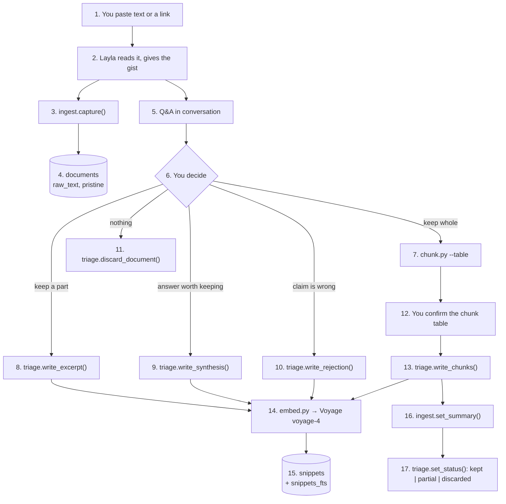
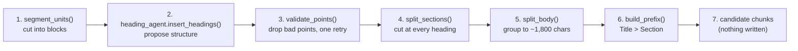
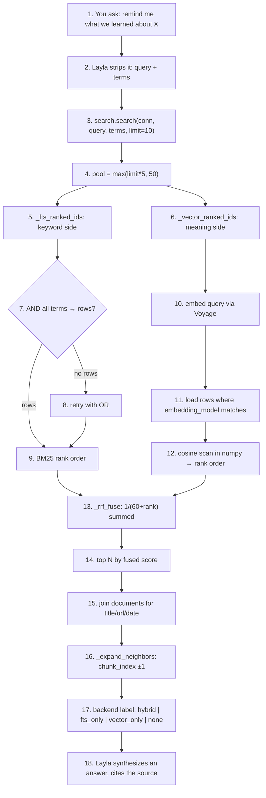

# Knowledge domain — system overview

*agents/knowledge/ · 8 modules + 1 SQLite file · written 2026-09-20*

Bird's-eye view of the architecture and data flow. Design rationale and the
numbered decision log live in `pipeline/PLAN.md`; the workflow Layla follows
lives in `AGENTS.md`. This file is the map, not the rules.

Diagram boxes are numbered so they can be referenced by number.

---

## 1. The shape of the system

You and Layla hold the conversation; eight plain Python modules hold the
plumbing; one SQLite file holds everything permanent. Nothing runs on its
own — every module is a library call Layla makes during a conversation, and
text only becomes searchable when you say so.

Three stages: **capture → triage → retrieve**, with a chunker hanging off the
middle.

- Capture puts text into `documents` unchanged.
- Triage decides what is worth keeping; only that lands in `snippets`.
- Retrieval reads `snippets` and never touches the archive.

---

## 2. Ingestion flow

Box 14 is best-effort. A failed embed writes the row with `embedding = NULL`
and reports the error — the snippet stays fully keyword-searchable and can be
backfilled later. It never blocks the write.

---

## 3. Inside the chunker (box 7)

Five steps in one file. It writes nothing; its output is a table you approve.

- Box 2 is the only LLM call in the ingest path — one call over the whole
  document, up to several minutes on a long transcript. `--no-llm` skips it
  and splits on the document's own headings instead.
- Box 3 is structural validation only: in-range, anchor matches, no
  duplicates. Heading *quality* is never graded here — see section 6.
- Box 6 drops the document's own H1 when a title was supplied; both fill the
  title slot, and repeating it wastes prefix chars in every embedded chunk.

---

## 4. Retrieval flow

- **Two searches, opposite blind spots.** Box 5 finds literal words and is
  blind to paraphrase; box 6 finds meaning and can miss a rare literal token.
- **Boxes 7→8 exist because FTS5 ANDs bare terms.** A sentence-shaped query
  demanded its function words too and matched nothing, so every real query
  silently ran `vector_only`. Layla passes content words as `terms`; all terms
  are required first, any term on the second pass.
- **Box 13 fuses ranks, not scores.** BM25 is unbounded and corpus-dependent,
  cosine is in [-1, 1] — incomparable, so only rank position is used.
- **Box 11 filters by `embedding_model`.** A row from a different model is
  invisible to vector search but still keyword-reachable; vectors from
  different spaces are never compared.
- **Box 16 never reads `raw_text`.** A chunk you discarded leaves a gap, so
  discarded material can never leak back through neighbor expansion.

---

## 5. Module map

| Module | Role | Called by |
|---|---|---|
| `db.py` | Schema + connection helper. Applies schema on first connect. | every module |
| `ingest.py` | Writes the `documents` row. Never fetches, never calls an LLM. | Layla |
| `chunk.py` | Splits a document into ~1,800-char candidate chunks with context prefixes. Only module with a CLI. | Layla |
| `heading_agent.py` | Proposes heading insertion points for unstructured text. | `chunk.py` only |
| `triage.py` | Writes `snippets`, batch-embeds them. The only write path into the corpus. | Layla |
| `embed.py` | Voyage `voyage-4`, float32 blob codec, `.env` key loading. | `triage.py`, `search.py` |
| `search.py` | BM25 + cosine, fused by RRF, neighbor expansion, source metadata. | Layla |
| `judge.py` / `eval.py` | Offline grading of heading quality. Dev-only. | nothing in the workflow |

---

## 6. What is deliberately absent

- **No synchronous quality gate.** `judge.py` never runs on the ingest path
  (decision 20) — it would add a second whole-document LLM call and couple
  two independent failures. You already gate chunk boundaries by eye at
  box 12 of the ingestion flow.
- **No bulk-import subagent.** `summarizer_agent.py` was dropped (decision 7):
  the workflow is one article at a time, and bulk mode's mechanism — keeping
  source text out of Layla's context — is exactly what discussion needs.
- **No scheduler, no daemon, no router process.** Every arrow in every diagram
  above is either you talking or Layla making a library call.

---

## 7. Two invariants that explain most of the design

1. **`documents` is archive, `snippets` is the index — never the same text
   twice.** `raw_text` is never searched or embedded. Search only ever queries
   `snippets` and joins `documents` back for title, url, and date.

2. **Nothing enters the corpus without an explicit yes, and no failure is
   fatal.** A dead Voyage call writes `embedding = NULL`; a dead heading model
   falls back to the document's own headings; a malformed FTS query degrades
   to `vector_only` instead of raising.
